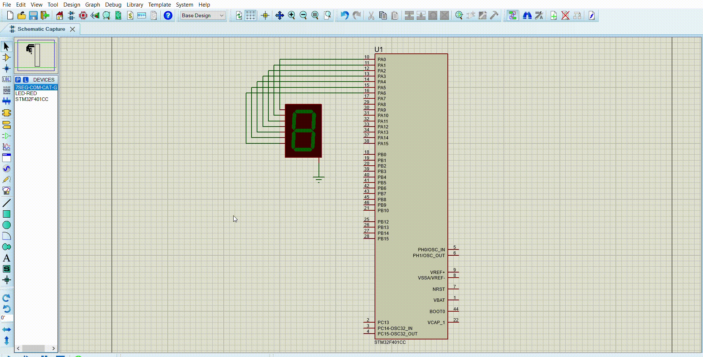

# Statement
## You are required to build a software that display a decimal counter value on a seven segment display.
### The expected output is as follow:
* GPIO.c file that include the implementation of the GPIO driver functions.
* GPIO.h file that include the declaration of the GPIO driver functions.
* Main.c file that use the GPIO functions to display a counter value on a seven segment display.
### The following requirements shall be followed during implementation.
* GPIO driver shall provide a function called GPIO_Init.
    - The function shall take the following arguments, port name, pin number, pin direction and default state.
    - The function shall initialize the GPIO registers as per the values passed through the arguments.
    - The function shall not have a return.
* GPIO driver shall provide a function called GPIO_WritePin.
    - The function shall have the following arguments, port name, pin number and data to be written (0 or 1).
    - The function shall check the initialized configuration of the requested pin argument. If it didn’t match the write request needs, it shall return NOK and didn’t perform the action.
    - If the pin initialization matches the needs of the write request, it shall return OK and perform the requested actions.
# Code File 

# Proteus File

