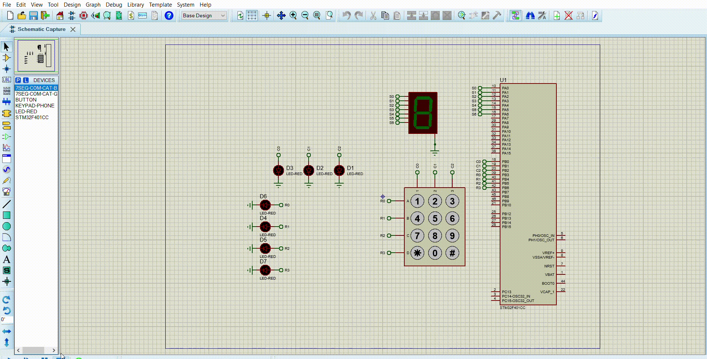

# Statement
## You are required to build a software that display a number on a seven-segment display after pressing a button on a keypad. The implemented GPIO driver shall be used to interface the Keypad and the seven-segment display.
### The expected output is as follow:
* Keypad.h that contains the declarations for the keypad manager APIs.
* Keypad.c that contains the implementations for the keypad driver APIs.
* Main.c that contains the implementation of the required application.
### The following requirements shall be followed during implementation.
* The implemented GPIO driver shall be used by the Keypad driver APIs.
* Keypdad_init
    - Function shall not take any arguments. It will be used to initialize the internal keypad driver variable(s).
* Keypad_manage
    - Function shall not take any arguments.
    - Function shall be called periodically from the infinite loop in main function.
    - Function shall scan all keys to check which one is pressed.
    - Once a valid key press detected, function shall do the following:
        - Store the pressed key value.
        - Call a function “KeypadCallouts_KeyPressNotificaton” and shall not pass any arguments to it.
    - Only a transition from no key pressed to one key press shall be considered as a valid press.
    - After the key press, the value of the stored key shall not be changed until the key is released.
    - The value of the stored key shall  not be changed until key is released and Keypad_GetKey function is called.
    - Function shall use lookup table implementation to define the value of the pressed key.
* Keypad_GetKey
    - Function shall be called by application to get the last stored key.
# Code File 

# Proteus File

