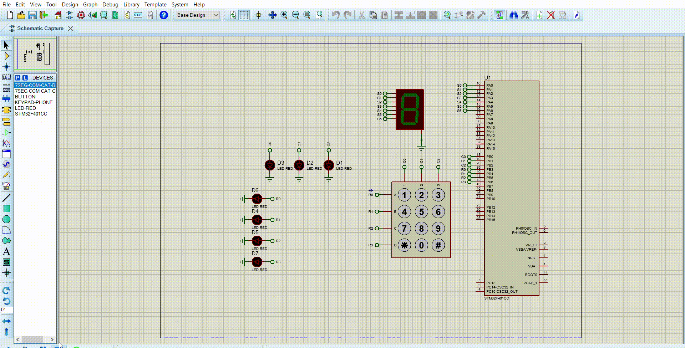

# Statement
* You are required to define a group of symbolic macros to define all the registers offsets in one GPIO channel.

* You are required to define a generic macro for the GPIO registers definition instead of using the library provided by STM.

* The Generic macro shall be on the form GPIO_REG(PORT_ID, REG_ID)
* You are required to rewrite the GPIO driver using the newly defined macro. You will use the register offset macros to be passed to REG_ID argument. No use of switch case for port selection.
# Code File 

# Proteus File

