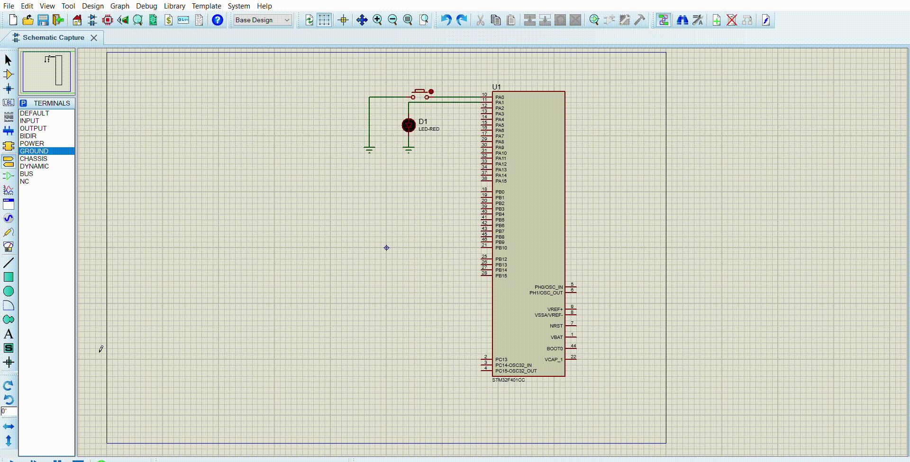

# Statement
### A software to perform an LED toggle based on a button press. The Software shall detect a falling edge event on the button pin and then toggle the LED in an ISR.
1. Enable GPIO clock and configure I/O as input line.
2. Enable SYSCFG clock (RCC_APB2ENR) & configure external interrupt line mapping in SYSCFG_EXTICR
3. Unmask the interrupt line in EXTI_IMR
4. Configure the trigger selection bits (Rising/falling) of the interrupt line EXTI_RTSR, EXTI_FTSR
5. Configure and enable the interrupt line in NVIC (NVIC_ISER)
6. When the interrupt is triggered clear pending bit by programming it to 1 in EXT1_PR
# Code File 

# Proteus File

