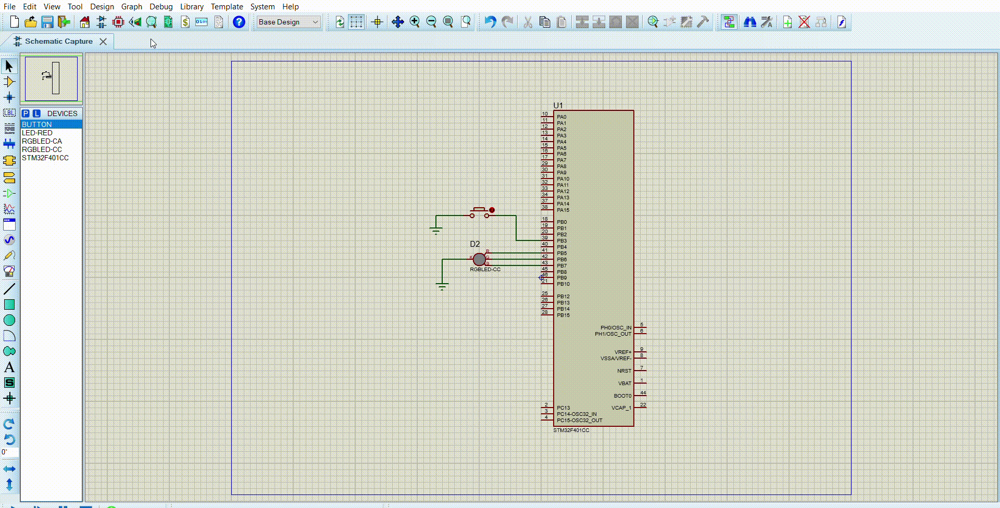

# Statement
## RGB LED controller.
* The system is consisted of 1 push button and 1 RGB LED. The Push button is connected to PORTB pin 3. The 3 LED pins are connected to port B pins 5, 6 and 7. The Push button is active low, without external pull up resistor.
* You are required to write a code that scans the button periodically. At each valid button press, the Software shall change the RGB LED color.
* A button press shall be considered valid only when a falling edge is detected on the button pin. Button debouncing feature shall be added. The LED shall provide 8 colors controlled by the enabled colors mix (RED + GREEN + BELOW).

# Code File 

# Proteus File

