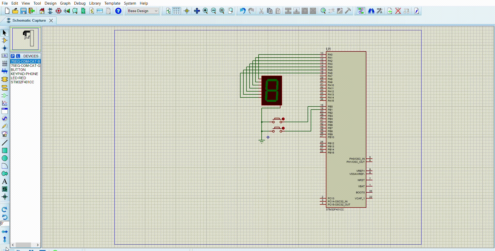

# Statement 
## A software to perform a decimal counter on a 7-segment display.
* System inputs shall be two push buttons. System output shall be 1 seven segment display.
* Two interrupts to be configured on GPIO falling edge, one for each button. The first ISR shall increment the counter. The second ISR shall decrement the counter. The main function shall perform the display actions.
* Race condition shall be taken into consideration to protect the counters from being corrupted.
# Code File 

# Proteus File

